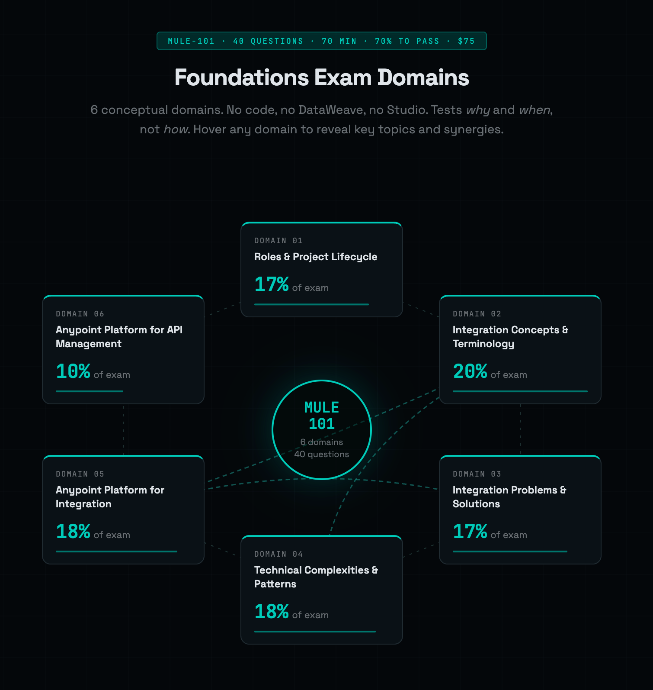
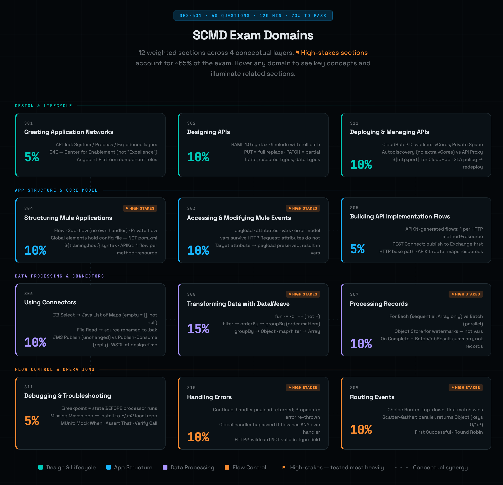
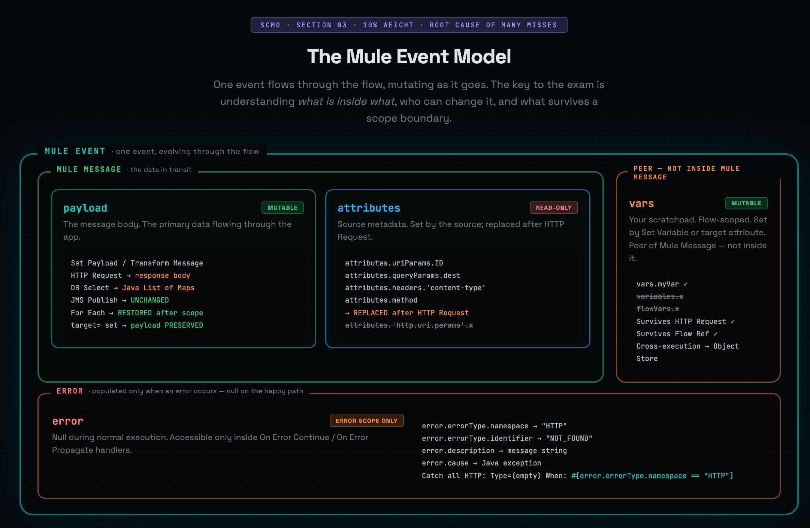
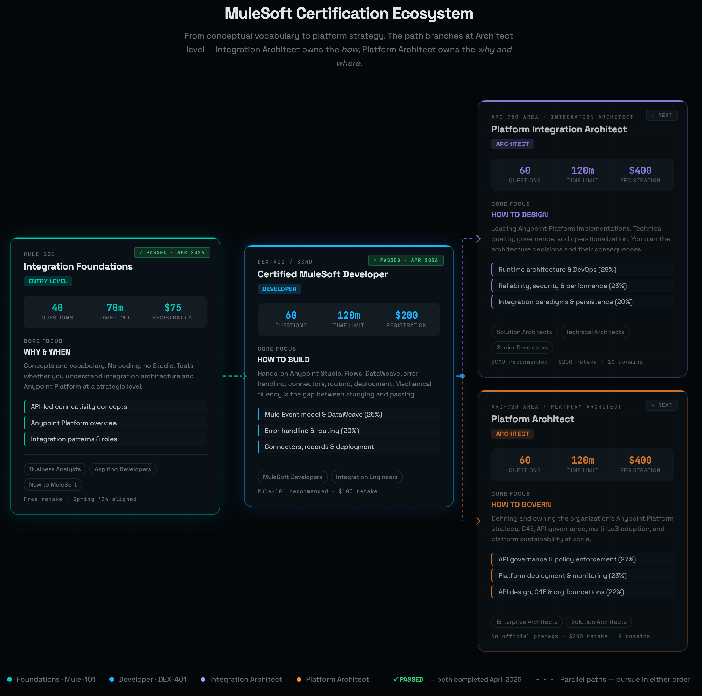
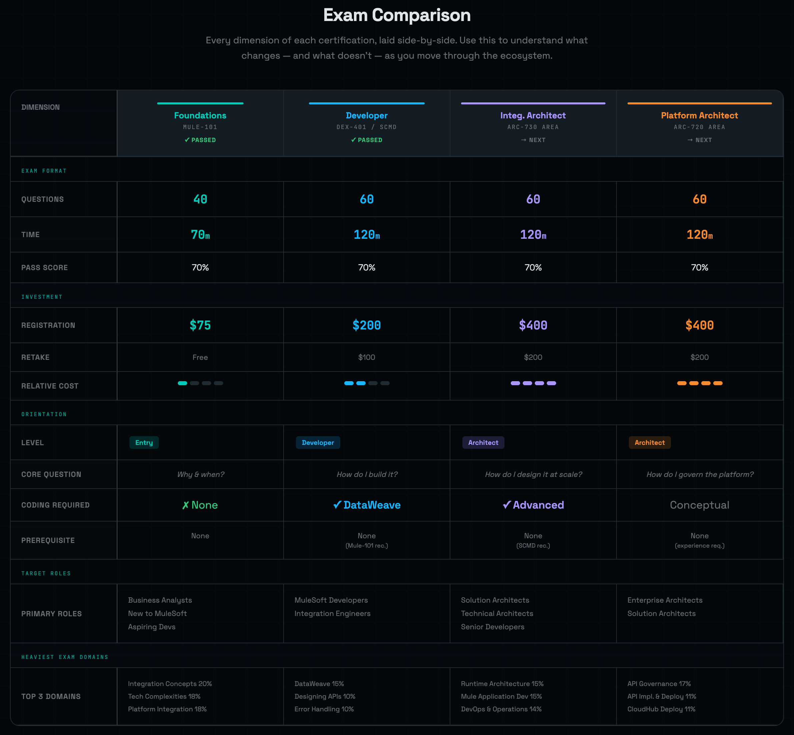

# Visual Study Resources

Two interactive HTML infographics built to make the MuleSoft certification ecosystem easier to navigate at a glance. Both are self-contained — open the file in any browser, or click the live links to view them on GitHub Pages.

The screenshots below are static previews. **Click any image to open the live, interactive version** — hover states, tab switching, and animated connector lines only work in the live versions.

---

## MuleSoft Certification Infographics

Three views of the certification content itself: domain breakdowns for the two exams I've sat for, plus a deep-dive on the single mental model that sits underneath most SCMD exam questions.

**[View live →](https://snowake4me.github.io/scmd-study-resources/resources/MuleSoft_Certification_Infographics.html)**

### Foundations · Mule-101

Six conceptual domains laid out around a central Mule-101 hub. No code, no DataWeave, no Studio — this exam tests *why* and *when*, not *how*. Hover any domain in the live view to reveal key topics and synergies between domains.

### SCMD · DEX-401

Twelve weighted sections across four conceptual layers — Design & Lifecycle, App Structure, Data Processing, and Flow Control. The flagged ⚑ sections account for ~65% of the exam. The live view draws connector lines between conceptually related sections on hover, which is genuinely the most useful study tool in this repo.

### The Mule Event Model

The single most load-bearing mental model on the SCMD exam, and the root cause of more missed questions than any other topic. What's inside a Mule Event, what's inside the Mule Message, what's mutable, what survives a scope boundary, and what only exists inside an Error Scope — all on one page.

---

## MuleSoft Certification Ecosystem

A view of the broader certification path — where Foundations and SCMD sit relative to the Architect tracks above them, and how the exams compare across format, cost, and content focus.

**[View live →](https://snowake4me.github.io/scmd-study-resources/resources/MuleSoft_Certification_Ecosystem.html)**

### Progression Map

The branching path from Mule-101 entry-level through Developer (SCMD), then forking into the two Architect tracks — Integration Architect (build) and Platform Architect (govern). Cards show registration cost, time limit, and target roles for each. Includes my own progression status as of April 2026.

### Exam Comparison

Side-by-side comparison of all four certs — exam format, investment, orientation, target roles, and the heaviest-weighted exam domains. Useful for deciding what to tackle next, or for helping a teammate figure out which cert maps to their role.

---

## A note on the screenshots

These are point-in-time captures. The live versions on GitHub Pages always reflect the current state of the HTML files in this folder. If a screenshot looks different from what you see when you click through, the live version is the source of truth.
